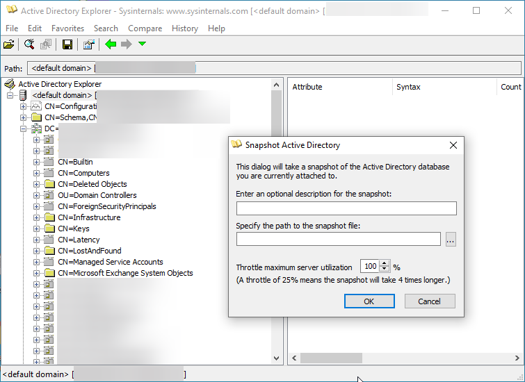
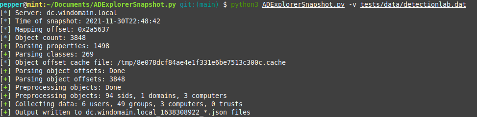

# ADExplorerSnapshot.py


ADExplorerSnapshot.py is an AD Explorer snapshot ingestor for [BloodHound](https://bloodhound.readthedocs.io/).

AD Explorer allows you to connect to a DC and browse LDAP data. It can also create snapshots of the server you are currently attached to. This tool allows you to the convert those snapshots to BloodHound-compatible JSON files.



## Limitations

The ingestor only supports offline information collection from the Snapshot file and won't interact with systems on the network. That means features like session and localadmin collection are not available. GPO/OU collection is missing. The ingestor processes all data it possibly can from the snapshot (including ACLs). You will only have the data available of the LDAP/DC that you ran the snapshot against.

## Installation

```
git clone https://github.com/c3c/ADExplorerSnapshot.py.git
cd ADExplorerSnapshot.py
pip3 install --user .
```

## Usage

```
usage: ADExplorerSnapshot.py [-h] [-v] snapshot

ADExplorer snapshot ingestor for BloodHound

positional arguments:
  snapshot

optional arguments:
  -h, --help  show this help message and exit
  -v          Enable verbose output
```



## Notes

Making snapshots in AD Explorer is more network-intensive than the traditional BloodHound ingestors as it attempts to retrieve all objects it can from the LDAP.

ADExplorerSnapshot.py will create caches of information for quicker lookups while processing the data. Especially when processing larger snapshots (e.g. 4GB+) you will also need to have sufficient RAM available. In my tests, about half of the snapshot file size was required in RAM.

The library was tested with a number of data sets, please create an issue report if you run into problems. 

The ADExplorer snapshot parser is implemented as its own module, which could also be used individually.

## License and credits

This code is licensed under the [MIT license](https://opensource.org/licenses/MIT).

ADExplorerSnapshot.py relies on the following projects:
 - [BloodHound.py](https://github.com/fox-it/BloodHound.py) (the Python BloodHound ingestor); for processing LDAP data.
 - [dissect.cstruct](https://github.com/fox-it/dissect.cstruct) (C-style binary struct parser): for parsing the binary snapshot data.
