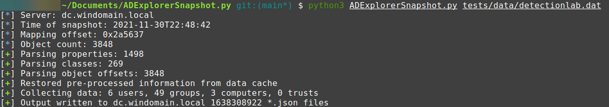

# ADExplorerSnapshot.py


ADExplorerSnapshot.py is an AD Explorer snapshot parser. It is made as an ingestor for [BloodHound](https://bloodhound.readthedocs.io/), and also supports full-object dumping to NDJSON.

AD Explorer allows you to connect to a DC and browse LDAP data. It can also create snapshots of the server you are currently attached to. This tool allows you to convert those snapshots to BloodHound-compatible JSON files, or dump all available objects in the snapshot to NDJSON for easier processing.


## What is supported

In `BloodHound` output mode: 
 * Users collection
 * Groups collection
 * Computers collection
 * Trusts collection (as visible from the LDAP DC you are connected to)

In `Objects` output mode, all attributes for every object are parsed and outputted to NDJSON format.

## Limitations

The ingestor for BloodHound only supports offline information collection from the snapshot file and won't interact with systems on the network. That means features like session and localadmin collection are not available. GPO/OU collection is missing. The ingestor processes all data it possibly can from the snapshot (including ACLs), but will only output the JSON data that can be interpreted by BloodHound. You will only have the data available of the LDAP/DC that you ran the snapshot against.

## Installation

ADExplorerSnapshot.py supports Python 3.6+. Dependencies are managed via pip.

```
git clone https://github.com/c3c/ADExplorerSnapshot.py.git
cd ADExplorerSnapshot.py
pip3 install --user .
```

Additionally, Certipy is required.

```
https://github.com/ly4k/Certipy.git
cd Certipy
python3 setup.py install
```

## Usage

```
usage: ADExplorerSnapshot.py [-h] [-o OUTPUT] [-m {BloodHound,Objects}] snapshot

ADExplorerSnapshot.py is an AD Explorer snapshot parser. It is made as an ingestor for BloodHound, and also supports full-object dumping to NDJSON.

positional arguments:
  snapshot              Path to the snapshot .dat file.

optional arguments:
  -h, --help            show this help message and exit
  -o OUTPUT, --output OUTPUT
                        Path to the *.json output folder. Folder will be created if it doesn't exist. 
                        Defaults to the current directory.
  -m {BloodHound,Objects}, --mode {BloodHound,Objects}
                        The output mode to use. Besides BloodHound JSON output files, it is possible
                        to dump all objects with all attributes to NDJSON.
                        Defaults to BloodHound output mode.
```



## Notes

This library is now supporting the BloodHound v4.1+ output format (JSON format v4). For the old v3 output format, you can use the code in the [v3-format branch](https://github.com/c3c/ADExplorerSnapshot.py/tree/v3-format).

Making snapshots in AD Explorer is more network-intensive than the traditional BloodHound ingestors as it attempts to retrieve all objects it can from the LDAP.

ADExplorerSnapshot.py will create caches of information for quicker lookups while processing the data. Especially when processing larger snapshots (e.g. 4GB+) you will also need to have sufficient RAM available. In my tests, about half of the snapshot file size was required in RAM.

The library was tested with a number of data sets, please create an issue report if you run into problems. 

The AD Explorer snapshot parser is implemented as its own module, which could also be used individually.

The format in which snapshots are stored by AD Explorer is proprietary and led to a fun reverse engineering journey. A 010 editor template is included in this repository, which I used for iteratively mapping out the contents of the snapshot into structs.

## License and credits

This code is licensed under the [MIT license](https://opensource.org/licenses/MIT) and makes use of code that is also licensed under the MIT license.

ADExplorerSnapshot.py relies on the following projects:
 - [BloodHound.py](https://github.com/fox-it/BloodHound.py) (the Python BloodHound ingestor): for processing LDAP data.
 - [dissect.cstruct](https://github.com/fox-it/dissect.cstruct) (C-style binary struct parser): for parsing the binary snapshot data.

Credits:
 - Cedric Van Bockhaven (Deloitte) for implementation
 - Marat Nigmatullin (Deloitte) for the idea
 
